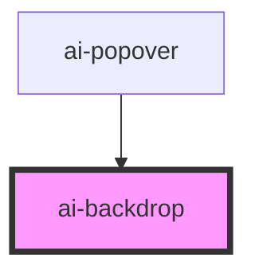

# ai-backdrop

<!-- Auto Generated Below -->

## Properties

| Property          | Attribute          | Description                      | Type      | Default |
| ----------------- | ------------------ | -------------------------------- | --------- | ------- |
| `stopPropagation` | `stop-propagation` | 点击背景时，是否阻止冒泡                     | `boolean` | `true`  |
| `tappable`        | `tappable`         | 背景是否可点击，默认为true，会出发aiBackdropTap | `boolean` | `true`  |
| `visible`         | `visible`          | 背景是否可见，默认可见                      | `boolean` | `true`  |

## Events

| Event           | Description | Type                |
| --------------- | ----------- | ------------------- |
| `aiBackdropTap` | 点击背景时出发的事件  | `CustomEvent<void>` |

## Dependencies

### Used by

 - [ai-popover](../popover)

### Graph

----------------------------------------------

*Built with [StencilJS](https://stenciljs.com/)*
