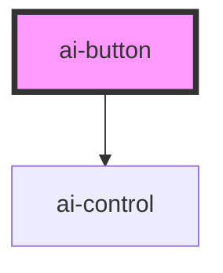

# ai-button

<!-- Auto Generated Below -->

## Properties

| Property   | Attribute  | Description | Type      | Default     |
| ---------- | ---------- | ----------- | --------- | ----------- |
| `disabled` | `disabled` | 是否禁用        | `boolean` | `false`     |
| `text`     | `text`     | 文字          | `string`  | `undefined` |

## Events

| Event     | Description | Type                      |
| --------- | ----------- | ------------------------- |
| `aiClick` | 点击          | `CustomEvent<MouseEvent>` |

## Dependencies

### Depends on

- [ai-control](../control)

### Graph

----------------------------------------------

*Built with [StencilJS](https://stenciljs.com/)*
