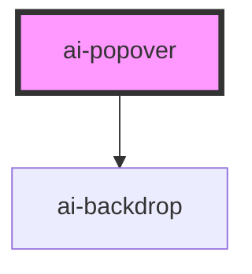

# ai-popover

<!-- Auto Generated Below -->

## Properties

| Property                    | Attribute          | Description    | Type                                | Default     |
| --------------------------- | ------------------ | -------------- | ----------------------------------- | ----------- |
| `backdropDismiss`           | `backdrop-dismiss` | 点击背景时关闭        | `boolean`                           | `true`      |
| `component` _(required)_    | `component`        | 在popover中显示的组件 | `Function \| HTMLElement \| string` | `undefined` |
| `componentProps`            | --                 | 传递给弹出窗的数据      | `{ [key: string]: any; }`           | `undefined` |
| `event`                     | `event`            | 触发动画的事件        | `any`                               | `undefined` |
| `overlayIndex` _(required)_ | `overlay-index`    | index值         | `number`                            | `undefined` |
| `showBackdrop`              | `show-backdrop`    | 是否显示背景         | `boolean`                           | `false`     |

## Events

| Event                  | Description  | Type                |
| ---------------------- | ------------ | ------------------- |
| `aiPopoverDidDismiss`  | 派发弹出层已销毁事件   | `CustomEvent<any>`  |
| `aiPopoverDidPresent`  | 派发完成事件       | `CustomEvent<void>` |
| `aiPopoverWillDismiss` | 派发弹出窗口关闭之前事件 | `CustomEvent<any>`  |
| `aiPopoverWillPresent` | 派发弹出之前事件     | `CustomEvent<void>` |

## Methods

### `dismiss(data?: any, role?: string) => Promise<boolean>`

关闭popover

#### Returns

Type: `Promise<boolean>`

### `onDidDismiss() => Promise<any>`

popover已经销毁

#### Returns

Type: `Promise<any>`

### `onWillDismiss() => Promise<any>`

popover即将销毁

#### Returns

Type: `Promise<any>`

### `present() => Promise<void>`

弹出popover

#### Returns

Type: `Promise<void>`

## Dependencies

### Depends on

- [ai-backdrop](../backdrop)

### Graph

----------------------------------------------

*Built with [StencilJS](https://stenciljs.com/)*
